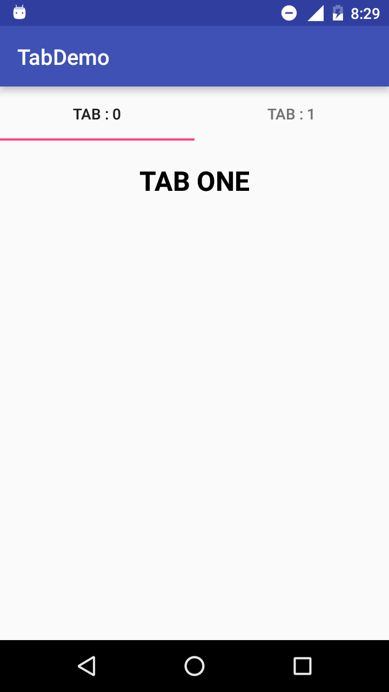
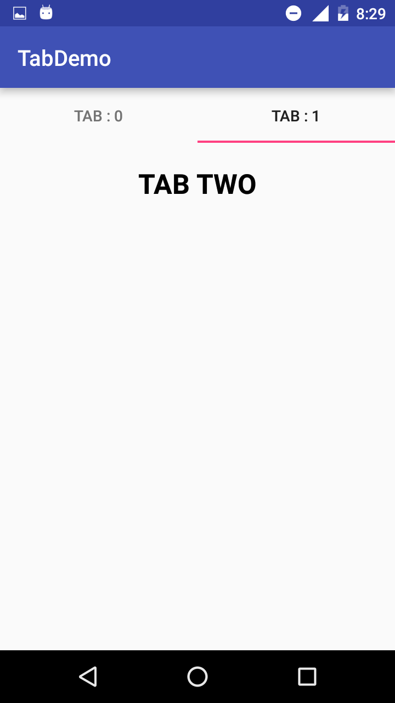

# HOW TO CREATE TAB ACTIVITY IN ANDROID

Follow the below steps

1) Go to ‘build.gradle’ of `Module:app` and add compile dependancy

    compile 'com.android.support:appcompat-v7:23.0.+'
    compile 'com.android.support:design:23.0.+'

2) In `activity_main.xml` file add below code

    <LinearLayout xmlns:android="http://schemas.android.com/apk/res/android"
        xmlns:tools="http://schemas.android.com/tools"
        android:orientation="vertical"
        android:id="@+id/activity_main"
        android:layout_width="match_parent"
        android:layout_height="match_parent"
        xmlns:app="http://schemas.android.com/apk/res-auto"
        tools:context="in.gauriinfotech.tabdemo.MainActivity">

        <android.support.design.widget.TabLayout
            android:id="@+id/tabs"
            app:tabGravity="fill"
            app:tabMode="fixed"
            android:layout_width="fill_parent"
            android:layout_height="50dp">

        </android.support.design.widget.TabLayout>
        <android.support.v4.view.ViewPager
            android:id="@+id/viewPager"
            android:layout_width="match_parent"
            android:layout_height="0dp"
            android:layout_weight=".7">

        </android.support.v4.view.ViewPager>

    </LinearLayout>

3) Now create `fragment_one.xml` in `layout` folder and insert below code

    <?xml version="1.0" encoding="utf-8"?>
    <LinearLayout xmlns:android="http://schemas.android.com/apk/res/android"
        android:orientation="vertical"
        android:layout_width="match_parent"
        android:layout_height="match_parent"
        android:gravity="center_horizontal"
        android:padding="20dp">
    
        <TextView
            android:text="TAB ONE"
            android:textColor="#000000"
            android:textSize="25sp"
            android:textStyle="bold"
            android:layout_width="wrap_content"
            android:layout_height="wrap_content" />
    
    </LinearLayout>

4) Create `fragment_two.xml` in `layout` folder and insert below code

    <?xml version="1.0" encoding="utf-8"?>
    <LinearLayout xmlns:android="http://schemas.android.com/apk/res/android"
        android:orientation="vertical"
        android:layout_width="match_parent"
        android:layout_height="match_parent"
        android:gravity="center_horizontal"
        android:padding="20dp">
    
        <TextView
            android:text="TAB TWO"
            android:textColor="#000000"
            android:textSize="25sp"
            android:textStyle="bold"
            android:layout_width="wrap_content"
            android:layout_height="wrap_content" />
    
    </LinearLayout>

5) Create `FragmentOne.java` file and add below code

    package in.gauriinfotech.tabdemo;
    
    import android.os.Bundle;
    import android.support.annotation.Nullable;
    import android.support.v4.app.Fragment;
    import android.view.LayoutInflater;
    import android.view.View;
    import android.view.ViewGroup;
    
    /**
     * Created by NiRRaNjAN on 10/02/17.
     */
    
    public class FragmentOne extends Fragment {
    
        @Nullable
        @Override
        public View onCreateView(LayoutInflater inflater, @Nullable ViewGroup container, @Nullable Bundle savedInstanceState) {
            return inflater.inflate(R.layout.fragment_one, container, false);
        }
    
    }

6) Create `FragmentTwo.java` file and add below code

    package in.gauriinfotech.tabdemo;
    
    import android.os.Bundle;
    import android.support.annotation.Nullable;
    import android.support.v4.app.Fragment;
    import android.view.LayoutInflater;
    import android.view.View;
    import android.view.ViewGroup;
    
    /**
     * Created by NiRRaNjAN on 10/02/17.
     */
    
    public class FragmentTwo extends Fragment {
    
        @Nullable
        @Override
        public View onCreateView(LayoutInflater inflater, @Nullable ViewGroup container, @Nullable Bundle savedInstanceState) {
            return inflater.inflate(R.layout.fragment_two, container, false);
        }
    
    }

7) Create `MyPagerAdapter.java` and add below code

    package in.gauriinfotech.tabdemo;
    
    import android.support.v4.app.Fragment;
    import android.support.v4.app.FragmentManager;
    import android.support.v4.app.FragmentPagerAdapter;
    
    /**
     * Created by NiRRaNjAN on 10/02/17.
     */
    
    public class MyPagerAdapter extends FragmentPagerAdapter {
    
        private final int TOTAL_TABS = 2;
    
        public MyPagerAdapter(FragmentManager fm) {
            super(fm);
        }
    
        @Override
        public Fragment getItem(int position) {
            Fragment fragment = null;
            switch(position) {
                case 0:
                    fragment = new FragmentOne();
                    break;
                case 1:
                    fragment = new FragmentTwo();
                    break;
            }
            return fragment;
        }
    
        @Override
        public int getCount() {
            return TOTAL_TABS;
        }

        @Override
        public CharSequence getPageTitle(int position) {
            return "TAB : " + position;
        }

    }

8) Add Below code in `MainActivity.java` file

    package in.gauriinfotech.tabdemo;
    
    import android.support.v4.view.ViewPager;
    import android.support.v7.app.AppCompatActivity;
    import android.os.Bundle;
    import android.support.design.widget.TabLayout;
    
    public class MainActivity extends AppCompatActivity {
    
        TabLayout tabLayout;
        ViewPager viewPager;
    
        @Override
        protected void onCreate(Bundle savedInstanceState) {
            super.onCreate(savedInstanceState);
            setContentView(R.layout.activity_main);
            tabLayout = (TabLayout) findViewById(R.id.tabs);
            viewPager = (ViewPager) findViewById(R.id.viewPager);
            MyPagerAdapter adapter = new MyPagerAdapter(getSupportFragmentManager());
            viewPager.setAdapter(adapter);
            if (tabLayout != null) {
                tabLayout.postDelayed(new Runnable() {
                    @Override
                    public void run() {
                        tabLayout.setupWithViewPager(viewPager);
                    }
                }, 1000);
            }
        }
    
    }

9) Run the project and done. Below are screenshots.

&nbsp;&nbsp;&nbsp;
